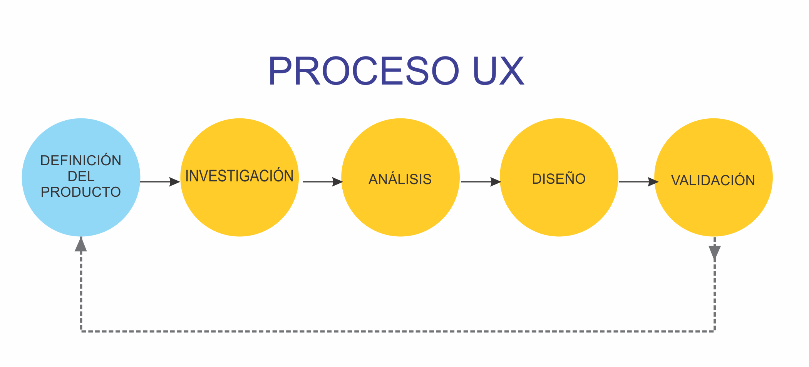

## Definición del Producto

Desarrollamos la propuesta de Strategist Pokémon GO como una opcion comoda y simple que permite acceder de forma fácil la información específica de cada pokémon de la isla de kanto. Datos específicos como su Id, nombre, altura, peso, hora probable de encuentro para capturarlo, tipo y debilidad; datos que permitirán generar una estrategia de juego más completa y eficaz; enfocado a jugadores nivel medio con una edad promedio de 27 años.

Para comenzar a diseñar Strategist Pokémon GO, seguimos el proceso UX, tal como se muestra en el siguiente diagrama.

## Investigación

Para conocer un poco más a nuestros jugadores (en éste caso nuestros usuarios), se realizó una encuesta a 14 personas, arrojándo los siguientes resultados: 

Edad promedio de los encuestados es de 27 años.
La mayoría de los encuestados son jugadores masculinos, dedican un aproximado de 5 horas semanales a jugar.
La gran mayoría les resulta interesante la pokédex que brinda la web, opinan que es suficiente/completa, sin embargo una pequeña parte la considera incompleta.

Un buen porcentaje contaron que es de gran importancia saber las debilidades y fortalezas de cada pokémon y utilizan aplicaciones o sitios web alternos para saber con más detalle de los pokemones; siendo Calcy IV la app más usada con un 25%.

Arrojó que de igual proporción nuestros usuarios juegan por hobby, esparcimiento al igual que lo realizan para atrapar pokémones para su colección.

Les resulta de gran relevancia tener una estrategia de juego para no sufrir en las batallas y así permitiéndoles subir de nivel.

En cuanto a si juegan sólos o en grupo, hubo un empate 50%.

[Aqui puedes revisar mayores detalles de nuestra investigación UX](https://drive.google.com/open?id=11u7ZxFe7yMA43Cb8CPaR8D7AJoGw2h5n0X3-jVJIc5Q)

## Investigación 
## Historias de Usuario 

1. Como jugador regular de Pokémon GO, quiero voy a (atacar) un gimnasio 
sería de utilidad poder conocer las debilidades de los pokemones según su propio tipo, ya que en base a estas pueden generar una estrategia de ataque.

2. Como jugador refgular de Pokémon GO, quiero saber la defensa y ataque de cada pokémon para tener una mejor estrategia a la hora de la batalla.

3.  Como jugador regular de Pokémon GO, quiero saber cuantos candy necesito para poder evolucionar a mi pokémon.
podría indicarme al momento de presentar la línea evolutiva de un pokémon, cuantos son los candy’s necesario para lograr la evolución.

4. Como jugador regular de Pokémon GO, quisiera saber en qué horario es más factible capturar a ciertos pokemones.
en la ficha o carta técnica de cara pokemon podría aparecer el horario de mayor frecuencia en el que aparece.

## A qué tipo de usuario va dirigido

Strategist Pokémon GO va dirido a usuarios regulares con un nivel medio en el juego y una edad promedio de 27 años. 
Que juegan por simple distracción y desean tener alguna estrategia de juego que les permita ganar una que otra batalla y de alguna manera coleccionar más pokémones.

## Definición del Problema

Pokémon GO es un juego en el que se vuelve muy importante conocer ciertas características más específicas de los pokémones, datos como la hora más probable de encuentro de un pokémon, las debilidades de un tipo de pokémon frente a otro, no están disponibles en la pokédex que incorpora el juego. Conocer ésta información permite a los jugadores generar una mejor estrategia de combate cuando vayan a generar un ataque y  tener certeza sobre la hora más probable de encuentro para capturar a un determinado pokémon, haciendo más eficaces las horas de juego y obteniendo mejores resultados.

## DISEÑO
### Testeo de baja fidelidad

Con el problema y el usuario definido llevamos a cabo el test de baja fidelidad usando herramientas como Sketching y wireframes, ya que es la forma más fácil de visualizar las ideas. Se dibujó a mano alzada para transmitir las ideas de forma rápida y sencilla, también flujos de navegación e interacción. 

Por medio de éste test se pudo reducir pantallas que eran innecesarias a la hora de interactuar en el proceso. Nos permitió visualizar las soluciones y decidir cual era el más asertivo. 

### Testeo de alta fidelidad

Una vez pasado el test de baja, se realizaron los ajustes adecuados, decartando las pantallas innecesarias y dejándo las útiles se llevó a cabo el prototipado en alta.
Para éste paso utilizamos FIGMA una herramienta de diseño de interfaz colaborativa donde podemos clickear como si estuvieramos en la App real.

[Aqui puedes revisar el prototipo de alta calidad](https://www.figma.com/file/JnvU0STLoUFQHGe1I4uMSeoJ/POKEMON-strategist?node-id=6%3A0)
(https://www.figma.com/proto/JnvU0STLoUFQHGe1I4uMSeoJ/POKEMON-strategist-MARTHA?node-id=0%3A1&scaling=scale-down)

### Pruebas de usabilidad

Se evaluó el producto con 5 usuarios representativos. Durante la prueba los usuarios siguieron una serie de tareas (en éste caso 3 tareas).
Se observó, escuchó y se tomó notas. Logrando identificar muy pocos problemas de usabilidad, determinando la satisfacción del usuario por el producto.

Los puntos a medir en los test de usabilidad fueron:
 1. Éxito en las tareas dadas.
 2. Timpo en realizar las tareas.
 3. Errores
 4. Evaluaciones heurísticas

[Aqui puedes revisar nuestra planificación en Trello](https://trello.com/b/j5Rkq8ZW)

## Fuente investigación / Referencia

https://www.ayerviernes.com/blog/pasos-para-preparar-una-propuesta-comercial-de-diseno-ux
https://theblog.adobe.com/ux-process-what-it-is-what-it-looks-like-and-why-its-important/
https://www.nngroup.com/articles/why-you-only-need-to-test-with-5-users/
https://www.youtube.com/watch?v=v8JJrDvQDF4
https://www.youtube.com/watch?v=V-An4Jfplew
https://www.youtube.com/watch?v=ky6wFiF5vMk

